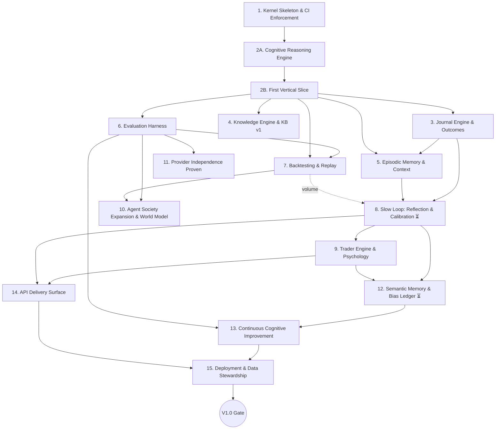

# DOLMIR Development Roadmap

**Status:** Approved — the official execution plan of DOLMIR. Foundation documents approved and committed (`Docs/architecture/DOLMIR_FOUNDATION.md`, cited throughout as EC / CA / CC / CogA for its four parts). Execution begins with Phase 1.

## How This Roadmap Works

1. **Phases execute strictly in order.** Each phase begins with its own short, focused planning pass (as Phase 1 already had) that turns its phase card into a concrete file-level plan, and ends with its exit criteria verified, CI green, and the increment pushed to the PR for review. No skipping.
2. **"Done" means exit criteria objectively met** — never "the code exists." Every phase leaves the system in a working, reviewable, releasable state.
3. **Testing, documentation, security review, and cost review are not phases — they are embedded in every phase's exit criteria** (see Cross-Cutting Disciplines). A trailing "testing phase" is how testing doesn't happen.
4. **Complexity is stated honestly as relative effort** — S (days), M (roughly a week or two of focused solo work), L (several weeks) — never as calendar dates, because solo availability is unknown and fabricated precision violates the project's own calibration principle (CC §5). Phases marked ⏳ additionally require **irreducible elapsed real-usage time** (data must accumulate) that no amount of engineering speed can compress.
5. **Amending the roadmap is allowed but never silent**: reordering, splitting, or adding phases is a written amendment with rationale, committed like everything else (same discipline as Constitution amendments).

## Amendments

**Amendment 1 (2026-07-09) — Phase 2 split into 2A and 2B.** The original Phase 2 bundled the generic reasoning infrastructure (graph executor, trace domain) together with its first trading application (LLM/vision adapters, four trading specialists, `dolmir analyze`). Split, at the product owner's direction: **Phase 2A** builds the Cognitive Reasoning Engine as pure, domain-agnostic infrastructure — nothing in it knows what trading, ICT, or liquidity is, so domain independence is guaranteed by construction rather than by discipline (DOLMIR could later reason about medicine or law by swapping domain specialists, per EC §8). **Phase 2B** is the original vertical-slice remainder, now built *on* 2A. Rationale: the reasoning capability is DOLMIR's highest-leverage component; entangling it with its first consumer would let trading vocabulary leak into the substrate. Elsewhere in this document, references to "Phase 2" as a dependency mean **2B** where live agents/LLM adapters are implied, and are already satisfied by **2A** where only the graph/trace machinery is meant.

## Phase Dependency Graph

The ⏳ phases' *machinery* ships on schedule; their *meaning* accumulates while later phases proceed — e.g., calibration data starts accruing when Phase 8 ships and is consumed in earnest by Phase 12, with Phases 9–11 executing in between. That is the dependency graph working as designed, not a skipped step.

## The Six Arcs

| Arc | Phases | What the system can do at the end of it |
|---|---|---|
| A — Foundation | 1–2B | Boot, enforce its own architecture, reason generically over any domain, produce one real explainable analysis end-to-end |
| B — Grounding & Record | 3–5 | Cite doctrine, record trades and outcomes, remember and retrieve its own past |
| C — Measurement | 6–7 | Grade its own agents, replay history without lookahead, benchmark itself |
| D — Learning | 8–9 | Learn from outcomes (process-graded), model the trader, modulate risk psychologically |
| E — Expansion | 10–13 | Grow the agent society where evidence justifies, prove provider independence, consolidate long-term memory, propose its own improvements |
| F — Product | 14–15 | Serve an API, install/upgrade/back up on a normal machine — V1.0 |

---

## Phase 1 — Kernel Skeleton & Architectural Enforcement

- **Objective:** A runnable, CI-enforced package skeleton: `kernel/` primitives, placeholder engine/orchestration/provider packages, and a `dolmir doctor` heartbeat command. *(Detailed implementation plan already approved separately; this card summarizes it.)*
- **Why it exists:** Every later phase's imports get policed by CI from the first commit (EC §3, CA §3.1). Retrofitting architectural enforcement onto an existing codebase is a multi-week tax; installing it before the code exists is nearly free.
- **Dependencies:** None (foundation docs approved).
- **Deliverables:** src-layout `dolmir` package (Python 3.12+, hatchling); `Result`/`EntityId`/`DomainEvent`/`Symbol`/`TimeRange` (`Money` deliberately deferred to its first consumer); `ClockPort` + `SystemClock`/`FixedClock`; `EventBusPort` + `InMemoryEventBus`; `DolmirSettings` (pydantic-settings, fail-fast); plugin protocol + allowlist (no entry_points); per-engine README placeholders; import-linter contracts encoding the layer rule and the CA §3.2 engine graph; GitHub Actions CI (ruff, mypy strict, lint-imports, pytest); root README; unit tests for every primitive.
- **Exit criteria:** CI green on PR #1; a deliberately-introduced forbidden import fails `lint-imports` (enforcement verified by seeing it fail); `dolmir doctor` reports OK with zero external infrastructure; broken config produces a loud, legible, non-zero exit.
- **Complexity:** S–M.
- **Risks:** Over-building kernel types nobody needs yet — mitigated by the `Money` deferral and shared-kernel change-control policy (CA §5).
- **Future impact:** The `ClockPort` decision made here is what makes Phase 7 backtesting possible without rewriting engines. The import contracts police every line of the next decade.

## Phase 2A — Cognitive Reasoning Engine *(Amendment 1)*

- **Objective:** The generic reasoning infrastructure every future specialist runs on: typed graph execution, structured reasoning objects, debate/falsification/decision staging, deterministic confidence synthesis, and the explainability pipeline — with **zero domain knowledge**. Nothing in this phase knows what trading, ICT, or liquidity is.
- **Why it exists:** Reasoning capability is DOLMIR's highest-leverage component (CogA). Building it before any consumer exists guarantees domain independence *by construction*: the engine is proven against a non-trading test domain, so future domains (EC §8) swap in specialists without touching the substrate.
- **Dependencies:** Phase 1.
- **Deliverables:** Graph executor (typed dataflow: nodes declare required/produced artifact *types*, edges are derived, independent nodes run concurrently, failure is data — `Result[NodeReport, NodeFailure]`); `GraphContext` (the run's working memory, CogA §11); structured reasoning objects with `schema_version` (Standing Rule 6): `Evidence`, `Claim` with epistemic-status tags (CC §8) and structural grounding (a FACT is unconstructible without citation/computation evidence — CC §2), `Hypothesis` requiring a pre-registered falsification condition (CC §4), `HypothesisSet` structurally requiring an inaction option (CC §6), `AgentOpinion` (per-hypothesis stances), `Challenge`/`FalsificationReport` (structural coverage of every hypothesis — CC §9), ordered `Confidence` vocabulary (CC §5) with deterministic synthesis (Standing Rule 4), `Conclusion`, `ReasoningTrace`; stage-node toolkit (deliberation, falsification, confidence synthesis, chief decision) with `ChiefDecisionPort` + a deterministic reference implementation; explanation builder rendering any completed trace into structured, legible prose (CC §11); `ReasoningTraceRepositoryPort` + in-memory adapter (SQLite arrives with 2B's CLI flow).
- **Exit criteria:** A complete reasoning run — observations → hypotheses → parallel debate → falsification → confidence synthesis → conclusion → explanation — demonstrated end-to-end in a deliberately **non-trading** test domain; the constitutional rules are enforced structurally (tests prove the illegal states are unconstructible); falsification is unskippable (a deciding graph without it fails assembly); full gate green in CI on PR #1.
- **Complexity:** L.
- **Risks:** Over-abstracting ahead of the first real consumer — mitigated by building exactly the mechanisms the Foundation's cognitive pipeline names, nothing speculative; 2B immediately validates the API against a real consumer.
- **Future impact:** Every agent DOLMIR ever runs — trading or otherwise — executes on this substrate. Its structural guarantees (grounding, falsifiability, inaction, mandatory self-critique) are what make the Cognitive Constitution enforceable rather than aspirational.

## Phase 2B — First Vertical Slice: One Explainable Analysis End-to-End

- **Objective:** `dolmir analyze <chart-image>` runs the fast loop minimally — perception → understanding → hypotheses (including no-trade) → debate → deterministic Risk Gate → trader-legible explained decision — with the full reasoning trace persisted.
- **Why it exists:** CA §20: the vertical slice *is* the acceptance test of the entire foundation, now including 2A's engine: the first real consumer validates the generic API.
- **Dependencies:** Phases 1, 2A.
- **Deliverables:** Anthropic `LLMProviderPort` adapter + cassette-based **contract test suite** (the template for all future providers); `ChartVisionExtractorPort` via multimodal call; four trading agents — combined Market/ICT Analyst, Risk Manager Agent, Devil's Advocate, Chief Decision Agent — as 2A graph nodes, plus the deterministic `RiskGate` as mandatory terminal node; SQLite `ReasoningTrace` persistence behind 2A's repository port; cost/latency instrumentation on every LLM call from call number one; `dolmir analyze`, `dolmir trace show`.
- **Key decision recorded:** chart-image input first, market-data vendor deferred to Phase 7 — no vendor dependency, it exercises the cognitive pipeline's perception stage directly, and it matches how an ICT trader actually works (charts, screenshots).
- **Exit criteria:** ≥3 different real charts produce structurally valid, trader-legible analyses, including at least one honest "no clear edge" conclusion; a trace fully reconstructs the reasoning behind a decision; the Risk Gate demonstrably vetoes an over-limit proposal; per-run cost is visible; CI green including LLM contract tests (cassettes).
- **Complexity:** M–L (reduced from L: the reasoning machinery already exists from 2A).
- **Risks:** Vision-extraction quality (mitigate: tightly-schema'd structured extraction, human-checkable output); prompt quality is unvalidated until Phase 6 — accepted and documented, not hidden; per-analysis LLM cost — tracked from the first call.
- **Future impact:** The trace/opinion schemas persisted here are the start of the system's lifetime memory — getting `schema_version` and epistemic tagging right now protects years of future data.

## Phase 3 — Journal Engine & Outcome Capture

- **Objective:** An append-only journal: the trader records trades, decisions, and outcomes; DOLMIR's own decisions link to their eventual outcomes.
- **Why it exists:** The journal is the ground truth that every learning mechanism consumes — slow loop, calibration, TraderProfile all read it. Without recorded outcomes, nothing can ever be learned (CC §7).
- **Dependencies:** Phase 1 (Phase 2B soft — decision↔trace linkage needs persisted traces to exist).
- **Deliverables:** Journal domain (immutable entries; the repository port exposes no update/delete — CA §6); decision↔trade↔outcome linkage; SQLite adapter; `dolmir journal add/list/link/close`; optional CSV import for pre-existing trade history.
- **Exit criteria:** Full round trip demonstrated: analysis → decision recorded → trade journaled → outcome recorded → linkage queryable; tests prove no mutation path exists.
- **Complexity:** M.
- **Risks:** Manual-entry friction makes the trader stop journaling — a genuine product risk, mitigated by minimal-keystroke CLI UX and the import path; flagged now because no later phase can compensate for an empty journal.
- **Future impact:** Phases 8, 9, and 12 are all built on this data. A schema mistake here is a data-loss mistake later — migrations get exercised from the first record.

## Phase 4 — Knowledge Engine & Knowledge Base v1

- **Objective:** Agents cite curated ICT/SMC/psychology doctrine retrieved from the Knowledge Base instead of trusting model weights.
- **Why it exists:** The grounding discipline (CC §2) and provider independence (doctrine survives model swaps — CA §12) both structurally require retrieval, not parametric memory.
- **Dependencies:** Phases 1, 2B (agents exist to consume it).
- **Deliverables:** Markdown front-matter schema; ingestion pipeline (chunk → embed → index) behind `EmbeddingProviderPort`; local vector-store adapter (library chosen in this phase's planning pass); `KnowledgeRepositoryPort.search()`; doctrine citations (document id + version) appearing in `AgentOpinion`s and traces; starter KB content — the user's collected material if provided by then, otherwise a small drafted starter set explicitly marked for the user's correction; `dolmir kb ingest/search`.
- **Exit criteria:** An agent's claim about a doctrine concept cites the KB passage that grounds it; editing a KB document changes system behavior with zero code changes (EC §6 verified); re-ingestion is idempotent.
- **Complexity:** M.
- **Risks:** **The user's educational material is still not in the repo** — this phase is content-blocked without it; the starter-KB path plus an early request to the user is the mitigation. Retrieval quality is ungraded until Phase 6.
- **Future impact:** Every future knowledge domain beyond ICT/SMC reuses this pipeline unchanged (EC §6); the citation mechanism is what keeps explanations honest for a decade.

## Phase 5 — Memory Engine v1: Episodic Memory & Unified Context

- **Objective:** Past analyses and their outcomes become retrievable experience: "have we seen this setup before, and what happened?"
- **Why it exists:** Compounding memory is the core product promise (EC §1); episodic records are also the replay corpus for every future re-derivation of higher-level models (CA §9/§11).
- **Dependencies:** Phases 2B (persisted traces), 3 (outcomes).
- **Deliverables:** `Episode` schema (versioned) assembled from trace + journal outcome; `EpisodicMemoryRepositoryPort` + SQLite/vector adapter; similarity retrieval that states *why* each episode was judged relevant (CogA §3 stage 3); `ContextAssembler` v1 fanning out to Knowledge + Episodic (Semantic slot present but stubbed until Phase 12) into one typed bundle; episode export/delete (EC §5 — user data control from the first record).
- **Exit criteria:** Analyzing a chart similar to a past episode surfaces that episode with its outcome and relevance reason inside the agents' context; `ContextAssembler` is the single read-side entry point agents use.
- **Complexity:** M.
- **Risks:** Similarity-retrieval quality (representation choice made in phase planning, properly measured only after Phase 6); premature generalization — guarded by keeping this phase purely episodic (derived beliefs are Phase 12's job, behind review).
- **Future impact:** This corpus becomes the system's lifetime experience; every learning phase mines it.

## Phase 6 — Evaluation Harness & Golden Datasets

- **Objective:** Agent quality becomes measurable and regression-protected.
- **Why it exists:** CA §21 makes agent-roster expansion conditional on *measured* improvement; prompts and models can't be changed safely without regression detection; and "the system improves" is otherwise vibes, which CC §1 forbids.
- **Dependencies:** Phase 2B (agents to evaluate); Phases 4–5 make eval scenarios realistic.
- **Deliverables:** Eval harness under `tests/evals/` (runnable locally and on-demand in CI — not per-commit, for cost); golden-dataset format (chart + context + expected analysis judgments, labeled by the user — their judgment is the ground truth); first small datasets (~10–20 scenarios per live agent role); scoring rubrics (structural validity, doctrine grounding, agreement with labeled judgment); a committed baseline scorecard.
- **Exit criteria:** Perturbing a prompt produces a visible score change (the harness demonstrably detects regressions); a baseline exists for every live agent; the labeling workflow is documented with its user-time cost stated honestly.
- **Complexity:** M–L.
- **Risks:** **Ground-truth labeling is user labor** — the project's scarcest resource; mitigated by starting tiny and growing incrementally. Overfitting prompts to the golden set — mitigated with held-out scenarios and rotation.
- **Future impact:** The gate every cognitive change passes through for the rest of the project's life; Phases 10, 11, and 13 are structurally impossible without it.

## Phase 7 — Backtesting, Replay & Benchmarking

- **Objective:** Run the fast loop against historical data *as of* a past moment, with zero lookahead, at volume.
- **Why it exists:** Validates the pipeline against history before real capital attention is at stake; generates decision volume for calibration far faster than live usage; the `ClockPort` discipline (Standing Rule 7) exists precisely for this payoff.
- **Dependencies:** Phases 2B, 6 (scored runs).
- **Deliverables:** `ReplayClock`; the first real `MarketDataProviderPort` adapter (historical OHLC; vendor and first instrument — the CA §22 deferred decision — chosen in this phase's planning pass); as-of data-access enforcement (nothing after time T reachable, tested); replay harness driving analyses across a date range; benchmark report presenting process-quality metrics and outcome statistics with honest caveats (CC §3: outcome ≠ process); `dolmir backtest run/report`.
- **Exit criteria:** A multi-week historical replay completes; a deliberately-introduced lookahead bug is caught by the enforcement tests; the benchmark report renders both process and outcome views.
- **Complexity:** L.
- **Risks:** Lookahead leakage is subtle and fatal to validity — dedicated tests and an API shape that makes it hard; historical-data cost/quality/licensing; replay LLM cost (sampled runs, cheap models for bulk stages).
- **Future impact:** The empirical engine for every future "does this change actually help?" question.

## Phase 8 — Slow Loop v1: Reflection & Calibration ⏳

- **Objective:** Outcomes flow back into the system: realized results are compared against pre-registered expectations, reasoning is graded on process independently of outcome, and a calibration record starts accumulating.
- **Why it exists:** This is where DOLMIR starts *learning* — CC §3 (process over outcome), §4 (pre-registration), §5 (calibration) become running code instead of principles.
- **Dependencies:** Phases 3, 5 (Phase 7 adds volume, optional but valuable).
- **Deliverables:** Outcome-observation stage (realized vs. the falsification condition locked in at decision time — never post-hoc); reflection stage with a process-grading rubric (deterministic checklist computed in code, LLM narration layered on top — Standing Rule 4); calibration store keyed by confidence level × setup type × session; `dolmir calibration report`; belief-update writes weighted by process quality, never raw win/loss.
- **Exit criteria:** Machinery runs end-to-end on real and replayed episodes; the calibration report renders honestly — including explicit "insufficient data" states instead of fake precision (CC §5); reflection verdicts are stored on episodes.
- **Complexity:** M–L. ⏳ Its *conclusions* require weeks-to-months of accumulated decisions; this phase ships machinery plus first data, explicitly not conclusions.
- **Risks:** Outcome quietly leaking into process grades (rubric design + tests keep the two channels separate); over-interpreting tiny samples (minimum-N gates built into the report).
- **Future impact:** Calibration data is the raw material for Phase 12's Bias Ledger, and the only honest basis for ever letting confidence influence position sizing.

## Phase 9 — Trader Engine v1: TraderProfile & Psychology Modulation

- **Objective:** The second half of the product thesis goes live: a behavioral model of *this trader*, derived from their actual record, modulating risk.
- **Why it exists:** The vision requires modeling trader and market simultaneously (EC §1). Sequenced here deliberately: by now the journal and graded episodes give the profile real data to be derived *from*, rather than questionnaire guesses.
- **Dependencies:** Phases 3, 5, 8 (process-graded episodes make derivations honest).
- **Deliverables:** `TraderProfile` schema (versioned): discipline patterns, session performance, post-loss/post-win behavior, recurring mistakes — every field carrying provenance (which episodes/statistics produced it, EC §5); deterministic statistics computed in engine code with the LLM narrating only (Standing Rule 4); the psychology modifier consumed exactly once, at Risk Evaluation, never in market debate (CC §10, CogA §9); `dolmir profile show/export/delete` — full user-control UX.
- **Exit criteria:** The profile derives from real data with citations ("why do you think I revenge-trade?" answers with specific episodes); a psychology-modified sizing decision shows the modifier and its reason in the trace; delete verifiably removes the data.
- **Complexity:** M–L.
- **Risks:** Psychological over-inference from small samples — every profile claim carries minimum-N gates and is tagged an Assumption, never a Fact (CC §8); data sensitivity — local-first storage and export/delete already in place before this phase starts.
- **Future impact:** The differentiator. Feeds Phase 12's consolidation and any future coaching-like capability.

## Phase 10 — Multi-Agent Society Expansion & InstrumentWorldModel

- **Objective:** Grow from four agents toward the full specialist society *where measurement justifies each addition*, and give the market side its persistent world model.
- **Why it exists:** The twelve-agent roster is a hypothesis, not a spec (CA §21) — now testable with Phase 6/7 machinery. The `InstrumentWorldModel` (CogA §8) makes market understanding persist between analyses instead of restarting each time.
- **Dependencies:** Phases 6, 7 (measurement); 2A/2B.
- **Deliverables:** Specialist splits (e.g., Liquidity Specialist, ICT/SMC split, Macro Analyst, Statistician-as-narrator) each A/B-validated against the combined baseline through the eval + backtest harness; debate v2 (opinions argue for/against the shared hypothesis set — CogA §3 stage 6); `InstrumentWorldModel` persistence with recency weighting and a fast-loop update stage; per-role model selection exercised for real (cheap models on mechanical detection roles).
- **Exit criteria:** Each added specialist shows measured improvement over the combined baseline — or is explicitly *not* added, with the comparison documented; the honest negative outcome is an allowed result. The world model visibly carries state between analyses ("this level was swept two sessions ago; it is no longer live").
- **Complexity:** L.
- **Risks:** Debate-theater — more agents, same decisions, higher cost; the A/B gate exists to catch exactly this. World-model staleness compounding — recency weighting, and its contents are tagged Assumptions, not Facts.
- **Future impact:** This is where DOLMIR becomes the "AI society" of the vision — exactly as far as evidence supports, and no further.

## Phase 11 — Provider Independence Proven

- **Objective:** A second LLM provider runs behind the same port; swappability becomes a tested fact rather than a law on paper.
- **Why it exists:** EC §4 is a Constitution law; until two providers pass one shared contract suite, it's an aspiration. Also the 10-year hedge against a shifting model landscape.
- **Dependencies:** Phase 2B (port + contract-suite template); Phase 6 (quality comparison).
- **Deliverables:** Second adapter (OpenAI/Gemini/DeepSeek — chosen at phase planning by capability/cost); the shared contract suite green on both; per-role provider swap via config demonstrated — same chart, same doctrine citations (RAG keeps doctrine provider-stable, CA §12); cost/latency/quality comparison report via the eval harness.
- **Exit criteria:** Swapping the Chief Decision Agent's provider through config alone produces a valid, doctrine-grounded analysis; contract suite green on both providers in CI (cassettes).
- **Complexity:** S–M.
- **Risks:** Capability asymmetry between providers (vision/structured-output support differ — the `supports_*` capability flags from Phase 2B exist for this); prompt portability is measured via evals, not assumed.
- **Future impact:** Model-landscape resilience, made real and continuously verified.

## Phase 12 — Semantic Memory, Consolidation & the Bias Ledger ⏳

- **Objective:** Distill accumulated episodes into durable, auditable generalizations about the trader and the system's own reasoning; detect systematic bias from calibration data.
- **Why it exists:** This is "learns over months and years" made concrete. Deferred until now *deliberately* (CA §21): consolidation on empty data is busywork; by this point Phases 8–11 have both built the machinery and let real data accumulate.
- **Dependencies:** Phases 5, 8, 9 — plus the elapsed real-usage time since Phase 8 shipped.
- **Deliverables:** Consolidation job (periodic, surfaced, never silent — CogA §4 stage 16); semantic facts with full episode provenance and a **trader review flow** (approve/reject derived beliefs about yourself — EC §5 user-control law); Bias Ledger entries mined from calibration slices (CogA §7), feeding Confidence Synthesis as named correction factors; the Semantic slot in `ContextAssembler` goes live.
- **Exit criteria:** A first set of real consolidated facts, each traceable to its episodes and reviewed by the trader; at least one Bias Ledger entry demonstrably adjusting a live confidence synthesis, with its reason visible in the trace.
- **Complexity:** L. ⏳ Hard-gated on accumulated real data — cannot be rushed by coding faster.
- **Risks:** Overgeneralization from noise (minimum-N, provenance, human review before activation); wrongness/creepiness of derived personal beliefs (review-before-active flow is the mitigation, not an afterthought).
- **Future impact:** The compounding flywheel: from here on, time spent using DOLMIR makes DOLMIR measurably better.

## Phase 13 — Continuous Cognitive Improvement Loop

- **Objective:** Close the loop fully: the system proposes its own improvements; every change flows through versioning and evals; nothing self-modifies silently.
- **Why it exists:** "It improves itself" from the vision, done safely: proposal → measurement → human approval — never silent drift (EC §2).
- **Dependencies:** Phases 6, 8, 12.
- **Deliverables:** Improvement-proposal mechanism sourced from reflection and bias patterns (e.g., "Devil's Advocate rarely finds issues when the first instinct is bullish — strengthen its adversarial prompt"); prompt/strategy versioning workflow with A/B through the eval harness; adoption/rollback records — an ADR-like log of cognitive changes; `dolmir improvements list/review`.
- **Exit criteria:** One full cycle executed end-to-end: proposal surfaced → evaluated → adopted or rejected → versioned and logged, human-approved at each step.
- **Complexity:** M.
- **Risks:** Eval-set overfitting through repeated optimization (held-out rotation from Phase 6); improvement churn (rate-limited, human-gated).
- **Future impact:** DOLMIR's long-run improvement stops depending on ad-hoc developer attention.

## Phase 14 — API & Second Delivery Surface

- **Objective:** A REST API exposing the same use cases the CLI has proven: analyze, journal, traces, calibration, profile.
- **Why it exists (and why now, not earlier):** Delivery adapters call use cases (EC §8, CA §3); letting the CLI stabilize the use-case layer first means the API is a thin adapter rather than a redesign. It unblocks any future UI with zero core work.
- **Dependencies:** Use cases stable (Phases 2B, 3, 5, 8, 9).
- **Deliverables:** API delivery adapter (framework chosen at phase planning; FastAPI the likely default); single-user local auth story (token); OpenAPI schema; CLI/API parity tests; a second composition root reusing the same wiring pattern (CA §19 pays off visibly).
- **Exit criteria:** Every CLI workflow achievable via the API; OpenAPI docs render; parity tested; **zero changes to engine or orchestration code** to add it — Open/Closed demonstrated at the delivery level.
- **Complexity:** M.
- **Risks:** Scope creep into building a UI (explicitly post-1.0); multi-user auth ambitions (explicitly out of scope).
- **Future impact:** The gateway for every future front-end — web, mobile, broker plugin — with no core changes.

## Phase 15 — Deployment, Packaging & Data Stewardship (V1.0 Hardening)

- **Objective:** DOLMIR installs, upgrades, backs up, and restores on a normal machine, by documentation alone.
- **Why it exists:** "Production-grade" (EC §10) includes being operable by someone who didn't build it. Local-first (EC §9) without a real backup/restore story is data-loss-first.
- **Dependencies:** All prior phases.
- **Deliverables:** Versioned releases (pip/uvx installable); the DB migration path exercised against real accumulated data (the `schema_version` investment harvested); backup/restore commands and docs; a complete data export/delete audit across every personal-data class; secrets-handling guidance; clean-machine install guide; upgrade guide.
- **Exit criteria:** Fresh machine → installed → full analyze/journal/reflect loop, following documentation only, in ≤30 minutes; a simulated upgrade from an older schema succeeds; a restore from backup is verified.
- **Complexity:** M.
- **Risks:** Migrations against real data always surprise — which is exactly why they're exercised here, before 1.0, not discovered after; documentation rot — docs are tested by following them literally on a clean machine.
- **Future impact:** The difference between a project and a product.

---

## The V1.0 Release Gate

V1.0 is tagged when, and only when:

1. All fifteen phases' exit criteria are met (each was verified at its own gate — this is a re-audit, not a first check).
2. The Engineering Constitution §10 production-quality definition passes an explicit section-by-section audit.
3. At least two LLM providers are green under one shared contract suite.
4. A calibration report exists over **≥3 months of real usage**, rendered honestly (including its insufficient-data cells).
5. The Knowledge Base contains real, user-vetted doctrine content (not just the starter set).
6. Documentation is current end-to-end (install, use, architecture, data stewardship).
7. No known critical bugs.

## Cross-Cutting Disciplines (not phases, by design)

- **Testing** — every phase ships its own tests; CI is the merge gate (CA §18). Phase 6 adds the *evaluation* layer, which is a different mechanism from tests (agent quality vs. code correctness).
- **Documentation** — every phase updates the docs and ADRs it touches; Phase 15 finishes and audits the set. The foundation doc is amended (never silently) if implementation reality contradicts it.
- **Security & privacy** — every phase touching personal data re-checks the EC §9 laws (local-first, no plaintext leaks, export/delete, audit trail); not a final-phase checklist.
- **Cost tracking** — every LLM call is instrumented from Phase 2B's first call; each phase review looks at the cost curve.

Why not phases: a trailing "testing/documentation phase" is the standard way those things quietly don't happen. Embedding them in every phase's exit criteria makes them non-skippable.

## Subsystem Coverage Map

Every subsystem from the project brief, mapped to where it's built:

| Subsystem | Phase(s) |
|---|---|
| Kernel | 1 (born), 15 (migrations exercised) |
| Orchestration | 2A (reasoning engine), 10 (debate v2), 13 (versioned strategies) |
| Market Engine | 2B (first analyst), 7 (historical data), 10 (InstrumentWorldModel) |
| Knowledge Engine | 4 |
| Trader Engine | 9 |
| Memory Engine | 5 (episodic), 12 (semantic + consolidation) |
| Journal Engine | 3 |
| Risk Engine | 2B (Risk Gate), 8 (calibration inputs), 9 (psychology modulation) |
| Provider Layer | 2B (pattern + first adapter), 11 (independence proven) |
| Vision | 2B (chart extraction), 10 (maturation with specialists) |
| LLM Integration | 2B, 11 |
| Knowledge Base (content) | 4, then continuously grown |
| Multi-Agent Society | 2A (debate/decision mechanics), 2B (live seed of four), 10 (evidence-gated expansion) |
| Learning System | 8, 12, 13 |
| Calibration System | 8 (record), 12 (Bias Ledger) |
| Cognitive Improvement | 13 |
| CLI | 1 (doctor), then grows every phase (2B, 3, 4, 7, 8, 9, 12, 13) |
| API | 14 |
| Testing | every phase (cross-cutting) + 6 (evals) |
| Benchmarking | 7 |
| Evaluation | 6 |
| Documentation | every phase (cross-cutting) + 15 (audit) |
| Deployment | 15 |

## Global Risks (spanning the whole roadmap)

1. **Solo-project stall** — the classic failure mode of ambitious solo systems. Mitigation is the roadmap's own structure: every phase ships something working and reviewable; no phase depends on a distant payoff to justify itself.
2. **User-supplied fuel** — three inputs only the user can provide: KB source material (Phase 4), golden-dataset labels (Phase 6), and journaling discipline (Phase 3 onward). Each is flagged inside its phase; none can be engineered around.
3. **LLM cost creep** — instrumented from the first call; cheap-model routing for mechanical roles; cassettes in tests; sampled replays in backtesting.
4. **Irreducible calendar time** — Phases 8 and 12 need real usage data that cannot be rushed (⏳). The dependency graph absorbs this: machinery ships on schedule, data accrues while Phases 9–11 execute.
5. **Model-landscape shift over a 10-year horizon** — provider independence (EC §4, Phase 11) plus versioned prompts/strategies (Phase 13) are the standing hedge.
6. **Roadmap rigidity** — reality will disagree with some card above. The amendment rule (How This Roadmap Works #5) makes course corrections explicit and cheap instead of silent and confusing.

## Explicitly Post-1.0 (out of scope for this roadmap)

Web/mobile UI; an Execution Engine (Constitution-gated: Risk Gate + non-bypassable human confirmation, EC §9 / Standing Rule 8); additional markets and analytical frameworks beyond the first; multi-user/team features; Postgres/NATS scale-out adapters; a third-party plugin ecosystem with `entry_points` discovery; live streaming data and alerting.

---

## Verification (for this roadmap document itself)

- All 23 subsystems from the request appear in the coverage map with concrete phase assignments.
- Every phase card carries all eight requested fields (Objective / Why / Dependencies / Deliverables / Exit criteria / Complexity / Risks / Future impact).
- Every phase is independently completable and reviewable: each ends CI-green with a working increment pushed to the PR.
- The phase ordering is consistent with the approved foundation's own sequencing laws (CA §21/§23: skeleton → slice → measurement before expansion; consolidation only after data exists; the 12-agent roster as evidence-gated hypothesis).
- Phase 1's card matches its already-approved implementation plan.
- No phase requires code to be written before this roadmap is approved.
