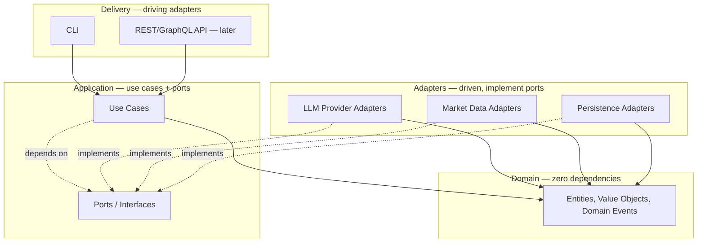
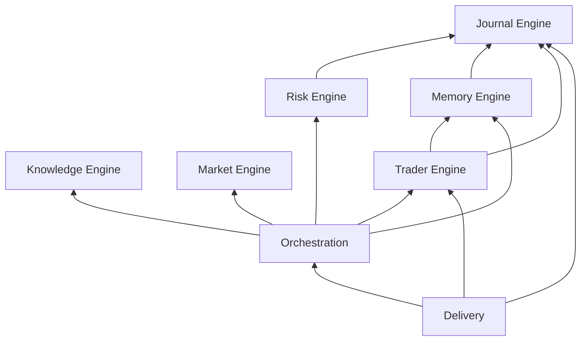
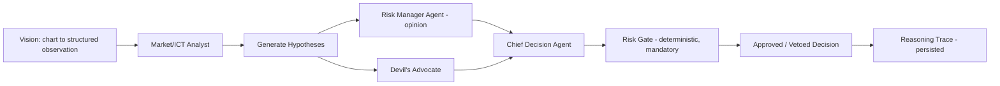
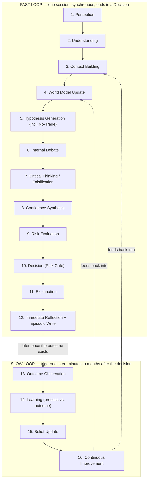

# DOLMIR — Foundational Constitutions & Architecture (v1)

*Part I–II design the Operating System (Engineering). Part III–IV design the Brain (Cognitive).*

## Context

The prior conversation where DOLMIR was originally conceived was lost to a sync issue between Claude Desktop and Claude Web. The user re-briefed the full product vision from scratch: DOLMIR is an "AI-native Trader Operating System" that models both the market (ICT/SMC as the primary framework) and the trader (a long-term psychological/behavioral profile) through a multi-agent cognitive pipeline, with every output explainable and the system compounding understanding over months and years.

A repository survey confirmed this is a genuine blank slate: two placeholder files (`README.md`, `Docs/REDME.md`), two commits, zero code, zero chosen tech stack, zero committed knowledge-base content. The user explicitly rejected rushing into code: "the foundation is the most important part of DOLMIR." They asked first for a Core Architecture, then — before it was finalized — for a permanent **Engineering Constitution**: a law that outlives any specific implementation, language, or library choice, readable on its own by a future contributor (human or AI) with no memory of this conversation.

Parts I and II are the result: a permanent Engineering Constitution (Part I) plus the Core Architecture that currently implements it (Part II). The architecture went through one adversarial review pass — a second critique specifically tasked with finding gaps, not rubber-stamping — before being finalized; its findings are incorporated throughout Part II, not appended as an afterthought. The single biggest correction from that pass: the original draft conflated "Engine" (a Domain-Driven-Design bounded context) with "kernel subsystem" (a runtime orchestration concept). Part II separates them explicitly — see Part II §4.

Parts I and II were approved. Before moving to implementation, the user asked for the complementary piece: not the Operating System's shape, but DOLMIR's actual mind — how it perceives, reasons, doubts itself, and learns across years — approached as a Cognitive Scientist and AI Researcher would, independent of any programming language. **Part III (Cognitive Constitution)** and **Part IV (Cognitive Architecture)** are that design, held to the same standard: durable principles first, current mechanisms second, self-critique throughout — including explicit critique of the pipeline the user proposed and of this document's own first-draft instincts. Parts III–IV deliberately discuss no implementation; they specify what DOLMIR's reasoning must do and why, and defer entirely to Parts I–II for how any of it gets built in code. No code gets written until all four parts are approved.

## How to Read This Document

Four parts, forming two pairs of the same shape.

**Part I — the Engineering Constitution** is permanent law for how DOLMIR is built. It should still be true after the language, the storage engine, or the entire agent-orchestration mechanism has been replaced.

**Part II — the Core Architecture** is the current best-known implementation of that law — expected to evolve as specific tech choices do.

**Part III — the Cognitive Constitution** is permanent law for how DOLMIR thinks: durable epistemic principles that hold regardless of which model, which prompting technique, or which orchestration framework ends up implementing them.

**Part IV — the Cognitive Architecture** is the current best-known design of the actual reasoning pipeline — expected to evolve as the system's real track record accumulates.

In both pairs, a change to the second element that violates the first is not a refactor; it's either a bug to fix or a deliberate, explicit amendment to the Constitution — rare, high blast radius, written down with its own rationale. Never silent drift.

---

## DOLMIR Engineering Constitution

### 1. Vision

**Why DOLMIR exists.** A trading decision is never purely a market fact. It is the interaction between market conditions and a specific human's psychology, discipline, and history. Almost every existing tool — charting platforms, signal services, journaling apps — models only the first half. DOLMIR exists to model both halves, explicitly and simultaneously, and to make the specific trader using it better over time.

**What problems it solves.** The gap between generic technical analysis and a trader's own recurring behavioral patterns. The lack of explainability in most AI-driven trading tools, where a recommendation arrives with no legible reason. The lack of persistent, compounding memory — most tools treat every session as the first one, learning nothing from the last thousand.

**What it must never become.** A signal provider — an oracle to blindly follow. An auto-trading bot — execution replacing human judgment. A black box — any recommendation without a traceable reason is a bug, not a feature. A static tool that doesn't improve with use. A system that optimizes for the trader's dependence on it rather than the trader's growth and independence — DOLMIR's success is measured by the trader getting better, not by the trader needing DOLMIR more.

### 2. Core Principles

- **Long-term thinking.** Every decision is evaluated against "does this still make sense in year five," not "does this ship fastest this week."
- **Explainability.** Every output — a decision, a risk verdict, a memory update, even a failure — must be traceable to the specific reasoning that produced it. There is no unexplainable behavior anywhere in the system, by policy.
- **Reliability.** The system behaves predictably and safely, especially at the boundaries that touch real capital or real personal data. Non-determinism is confined to where it adds value (an agent's own reasoning); it never touches the parts of the system that must behave identically twice.
- **Simplicity over unnecessary complexity.** Build what today's understood need requires. Design so tomorrow's requirements don't force a rewrite. Complexity must be justified by a real, current need — never a hypothetical future one worn as a justification in advance.
- **Human-centered AI.** DOLMIR augments the trader's judgment. It never overrides it silently, never acts without visibility, and the human is always the final decision-maker.
- **Continuous learning.** The system is expected to be measurably different — better at understanding this market and this trader — a year from now than today, through structured memory and feedback. Never through silently changing behavior no one can account for.

### 3. Architecture Laws

- **Dependency rules.** Dependencies point inward only. Nothing inside the Domain or Application layers ever depends on a concrete Adapter. No exceptions without a written amendment.
- **Layer boundaries.** Domain, Application, Adapters, and Delivery are never conflated. A layer never reaches past its immediate neighbor.
- **Module independence.** Every Engine (bounded context) owns its own domain and can be understood, tested, and changed without reading another Engine's internals.
- **Interface-first design.** Every dependency that crosses a boundary is a Port, defined by the consumer, before any concrete implementation exists.
- **No circular dependencies.** Enforced mechanically. A cyclic import is a build failure, never a code-review suggestion.
- **Provider independence.** No Engine, Agent, or use case ever imports a vendor SDK directly. All external capability is reached through a Port.

*(Part II §3 shows the current diagrams and CI mechanism that enforce these laws in code — the laws themselves outlive that specific mechanism.)*

### 4. AI Principles

- **AI providers are replaceable.** Claude, GPT, Gemini, DeepSeek, and any future model are adapters behind one interface — never a foundation anything else is built against.
- **No module may depend directly on OpenAI, Claude, Gemini, or any specific model.** Only on the provider-agnostic interface and its DTOs.
- **Every provider must implement the same interface**, verified by the same shared contract test suite. "Swappable" is a tested property, not an aspiration.
- **The reasoning pipeline must be deterministic wherever possible.** Orchestration, routing, data-passing, and hard risk constraints are plain deterministic code. Only an individual agent's own inference call is allowed to be non-deterministic, and it is isolated behind a Port specifically so that non-determinism never leaks into the parts of the system that must behave the same way twice.

### 5. Memory Principles

- **Memory must be structured.** No raw text dumped into a store hoping retrieval works. Every memory record has a typed schema and a version.
- **Memory must be auditable.** Any fact DOLMIR "remembers" about the trader is traceable to the specific episode(s) that produced it.
- **Memory must be explainable.** "Why does DOLMIR think I revenge-trade" has a legible answer — never just a black-box similarity score.
- **Every memory entry has a reason for existing.** No silent, unexplained accumulation of data. If it's stored, a named use case needs it.
- **The user always remains in control of their personal data.** They can view, export, or delete what DOLMIR has learned about them. Memory serves the trader; it is never used against their interest or outside their visibility.

### 6. Knowledge Principles

- **Knowledge is separated from reasoning.** Curated doctrine is never conflated with a specific agent's live inference — an agent consults knowledge, it does not improvise a redefinition of a core concept mid-analysis.
- **The knowledge base evolves independently.** Updating what DOLMIR knows about ICT/SMC, psychology, or risk management never requires touching orchestration or agent code.
- **The system must support multiple knowledge domains.** ICT/SMC is the first framework, not the only one that will ever exist. The knowledge architecture must never assume any single framework is permanent.

### 7. Coding Standards

*(Stated as durable law here; the specific languages and tools currently satisfying these standards are in Part II §14 — the standards outlive any one tool choice.)*

- Clean Architecture, SOLID.
- High cohesion, low coupling — every module does one thing and depends on as little as possible.
- Testability is not optional. If a design can't be tested without extensive mocking gymnastics, the design is wrong, not the test.
- Readability over cleverness. Code is read far more often than it's written, by people — and future AI sessions — with no memory of why a clever line seemed clever at the time. Prefer the boring, obvious solution.

### 8. Extension Rules

New capability is always additive — a new module plugs in without modifying an existing one (Open/Closed at the system level). Concretely:

- **Future AI providers** register a new adapter, not a change to any Engine.
- **Future markets** register a new market-data adapter, not a change to Market Engine's domain logic.
- **Future trading strategies/frameworks** beyond ICT/SMC become new Knowledge domains and possibly new specialist Agents, not a rewrite of the Reasoning Graph.
- **Future applications** (mobile, web, a broker plugin) are new Delivery adapters calling the same Application use cases, never a fork of the Core.

### 9. Security Principles

- **Local-first whenever practical.** The trader's behavioral and financial data defaults to living on infrastructure the trader controls, not a third party's server, unless they explicitly choose otherwise.
- **Sensitive user data is protected.** Encrypted at rest where it leaves local control, never logged in plaintext, never sent to a provider or plugin not explicitly trusted for that data class.
- **Explicit permission before destructive or irreversible actions.** True of DOLMIR's own engineering practice (no silent data deletion, no unreviewed irreversible operations) and true of any future execution capability — nothing irreversible happens without a human explicitly confirming that specific action, in the moment.
- **Complete audit trail.** Every decision, every memory update, every configuration change that affects behavior is attributable and reconstructable after the fact.

### 10. Definition of Production Quality

"Production-grade," for DOLMIR specifically, means:

- Every one of the nine preceding sections is true of the code as shipped — not aspired to, not documented-but-unenforced.
- A new Engine can be added in year five, by someone who has never met the original author, by following this Constitution alone, without breaking anything that exists.
- Every decision DOLMIR produces can be explained to the trader in plain language, traced through the reasoning graph, and reproduced from the persisted trace.
- The system fails loudly and safely when something is wrong, and never silently produces a plausible-looking wrong answer.
- Test coverage and architectural enforcement in CI are the actual gate for merging code — not a promise made in a README.
- It explicitly does **not** mean "feature-complete" or "handles every edge case." Production-grade is a statement about the reliability, explainability, and structural integrity of what exists today — not about how much exists yet.

---

## Core Architecture (Current Design)

**Executive summary:** Modular monolith (not microservices — that's premature distributed-systems complexity for a single current user). Clean Architecture dependency rule enforced by CI, not just convention. Six true bounded-context Engines (Market, Journal, Risk, Memory, Knowledge, Trader) plus a separate Orchestration layer that conducts them — Orchestration is the "scheduler," not a seventh Engine. A typed Reasoning Graph (not a free-form agent chat loop) drives the cognitive pipeline; a separate Event Bus handles cross-engine, decoupled facts — the two are never used for the same job. A deterministic Risk Gate (zero LLM involvement) structurally gates every decision; the Risk Manager *Agent* is just another debate participant with no special power. Recommended stack: **Python 3.12+**, stated as a recommendation, not a locked decision — say so if you'd rather go another direction. Point 20 of your original list ("explain why") isn't a separate section below — every section states its rationale inline, because a rule without a stated reason doesn't survive year-3 pressure to cut a corner.

### 1. Governing Metaphor: DOLMIR as an Operating System

| OS concept | DOLMIR concept |
|---|---|
| Kernel | The Core — domain + application logic, zero I/O specifics, zero vendor specifics |
| Syscalls | Ports (interfaces the kernel depends on or exposes) |
| Drivers | Adapters (concrete LLM providers, market data feeds, storage) |
| Kernel subsystems | Engines (Market, Trader, Risk, Memory, Knowledge, Journal) |
| Scheduler | Orchestration (runs Agents as scheduled "processes" through the Reasoning Graph) |
| Message bus | Event Bus (cross-subsystem, decoupled, "something happened") |
| Boot configuration | Configuration System (validated at startup, fails fast) |
| Installable drivers/modules | Plugin System |

This isn't decoration — it's the test every future addition should pass. "Is this a new subsystem, a new driver for an existing subsystem, or a new syscall?" is a more precise question than "where do I put this file," and it's the question that keeps the architecture coherent after the person asking it has forgotten this document exists.

### 2. Standing Rules

Read this before writing any code, ever. Every rule below implements a Constitution principle and is justified in its own section; this is the scannable version.

1. **Dependencies point inward only**, mechanically enforced in CI (not just convention) — §3. *(Constitution §3, Architecture Laws)*
2. **"Engine" means bounded context. Orchestration is not an Engine.** Don't add a 7th/8th/9th "Engine" for something that's actually cross-cutting conductor logic — §4.
3. **The Reasoning Graph coordinates one run's internal flow; the Event Bus decouples facts across engines/requests. Never use one to do the other's job** — §8/§9.
4. **Deterministic, exact computation is never delegated to an LLM agent just because a role name sounds like the natural owner.** Win rate, R-multiples, position sizing, drawdown, the Risk Gate's arithmetic: plain code. Agents narrate/interpret numbers the engine already computed exactly; they never compute them via token prediction — §8. *(Constitution §4, AI Principles)*
5. **Illegal states are unrepresentable.** `ApprovedDecision` has no public constructor other than `RiskGate.evaluate()` — §8.
6. **Every persisted record carries a `schema_version`.** Decide the migration/upcaster strategy now, before the first record is ever written — §6/§17. *(Constitution §5, Memory Principles)*
7. **Time is always injected via `ClockPort`, never read directly (`datetime.now()` is banned in domain/application code).** This is what makes backtesting possible later without a rewrite — §6.
8. **DOLMIR proposes. It never executes a trade.** If an Execution Engine is ever built, it's a separate Engine gated by both the Risk Gate and an explicit, non-bypassable human confirmation — §8. *(Constitution §9, Security Principles)*
9. **Plugins never auto-load.** Explicit allowlist in config, always — §13. *(Constitution §9, Security Principles)*

### 3. Overall Architecture Diagram *(ask #1)*

#### 3.1 Clean Architecture layering



Dependencies only point inward. Domain imports nothing from this project. Application imports Domain and its own Ports — never a concrete Adapter. Adapters implement Application's Ports and may translate into Domain types, but Domain never imports Adapters. Delivery calls Application's use cases — never the reverse.

**Ports are owned by the layer that consumes them, not the layer that implements them** — this is the Dependency Inversion Principle detail that's easy to get backwards: the Application layer defines `LLMProviderPort` because it *needs* completions; `providers/llm/` implements it because that's where the vendor detail lives. If this were flipped (infra defines the interface, core depends on infra's shape), swapping Claude for Gemini would ripple into the core. It shouldn't, and with this direction, it can't.

**Enforcement:** convention alone erodes over a 10-year, multi-session timeline. From day one, a CI check (`import-linter` contracts, or a small custom AST test) fails the build if `domain/` imports anything from `adapters/`, if `application/` imports a concrete adapter instead of a port, etc. Architecture-as-code, not architecture-as-tribal-knowledge — this is the concrete enforcement of Constitution §3.

#### 3.2 Engine dependency graph



Market, Journal, and Knowledge are leaves — they depend on no other engine. This graph is acyclic by design, and it's an architectural decision, not an implementation detail: any new edge added later (e.g., a future engine reading Trader's profile) gets an ADR, and the same CI mechanism that enforces layering also enforces this specific graph so a cycle can't sneak in through an innocuous-looking import.

#### 3.3 Reasoning Graph — illustrative V1 shape



Note the two different kinds of boxes: `RiskAgent`/`Devil`/`Chief`/`MarketNode` are LLM-backed agents (non-deterministic, typed I/O). `Gate` is plain deterministic code (§2, Rule 4). This distinction is the whole point of splitting Risk Manager Agent from Risk Gate — see §8.

### 4. Domain Boundaries: Engines vs. Orchestration *(ask #3)*

The original draft treated "Reasoning Engine" and "Vision" as peer bounded contexts alongside Market/Trader/Risk/etc. The review pass correctly flagged this: a bounded context owns aggregates, invariants, and a piece of the ubiquitous language. Orchestration and Vision don't — they're mechanisms. Conflating "bounded context" with "kernel subsystem" is where most of the original design's rough edges came from, so this version draws the line explicitly:

| | Owns | Explicitly does NOT own | Depends on (engines) |
|---|---|---|---|
| **Knowledge Engine** | Curated ICT/SMC/psychology/risk doctrine; RAG retrieval | Anything derived from *this trader's* own experience (that's Memory) | none — leaf |
| **Market Engine** | Market structure, liquidity, order blocks, FVGs, sessions/kill zones, macro & news calendar, HTF context | Deciding trades, sizing risk, raw chart-pixel parsing (delegates to `providers/vision`) | none — leaf |
| **Journal Engine** | Immutable, append-only ledger: every trade, decision, outcome, timestamped | Any interpretation of that data (that's Trader/Memory's job) | none — leaf |
| **Risk Engine** | The `RiskGate` (deterministic, mandatory, zero LLM), position sizing, hard limits | Being an LLM debate participant with special powers (that's the separate Risk Manager *Agent*, living in Orchestration) | Journal (read — realized risk stats) |
| **Memory Engine** | Episodic layer (indexed past analyses + outcomes) + Semantic layer (self-derived generalizations, e.g. "revenge-trades after 2 losses") | Curated external doctrine (Knowledge's job); ephemeral in-flight session state (Orchestration's job) | Journal (read) |
| **Trader Engine** | `TraderProfile`: psychology, discipline, risk tolerance, recurring mistakes, preferred sessions/setups | Raw event logging (Journal's job) | Journal, Memory (read) |
| **Orchestration** | Reasoning Graph executor, Agent scheduling, the small `Hypothesis`/`AgentOpinion`/`ReasoningTrace` domain, `ContextAssembler` | Being a bounded context other engines depend on — nothing depends on Orchestration except Delivery | Market, Risk, Trader, Memory, Knowledge, `providers/*` |

Two specific reclassifications from the original draft, both from the review pass:

- **Vision is demoted from an Engine to a Provider.** It has no aggregates or invariants of its own — it's "chart image → structured observation," i.e., a sophisticated adapter behind `ChartVisionExtractorPort` in `providers/vision/`, primarily consumed by Market Engine. If it's ever reused identically elsewhere (broker screenshots for Journal, COT report PDFs for Macro), that reuse is exactly what `providers/` exists for.
- **Reasoning is split.** The graph-execution machinery is scheduling infrastructure, not a bounded context — it lives in `orchestration/`. The genuinely small domain concepts it needs identity for (`Hypothesis`, `AgentOpinion`, `ReasoningTrace`) live alongside it in `orchestration/trace/`, because they're tightly coupled to graph execution, not because Orchestration is secretly an Engine wearing a different hat.

**Rule for where a new port lives** (this avoids relitigating it every time a new capability shows up): if a capability is consumed by multiple engines or by Orchestration directly, it's a `providers/` concern (LLM completion, vision extraction, embeddings — all consumed 3+ places). If it's consumed by exactly one engine, it lives inside that engine's own `application/ports` + `adapters/`, even if it's also an external API call (e.g. `MarketDataProviderPort` is only ever used by Market Engine, so it stays there rather than in `providers/`).

### 5. Folder Structure *(ask #2)*

```
dolmir/
├── kernel/                     # tiny, high-change-control shared substrate
│   ├── shared_kernel/            # Symbol, Money, TimeRange, EntityId, Result/Ok/Err, DomainEvent base
│   ├── clock/                    # ClockPort + SystemClock / FixedClock adapters
│   ├── event_bus/                # EventBusPort + InMemoryEventBus adapter
│   ├── config/                   # Settings schema (Pydantic) + layered loader
│   └── plugin_system/            # Plugin protocol, PluginContext, allowlist
│
├── orchestration/               # the scheduler — NOT a bounded context
│   ├── graph/                    # GraphNode protocol, executor, NodeFailure
│   ├── agents/                   # Agent base, per-role model selection, prompt/strategy versioning
│   ├── context/                  # ContextAssembler — fans out to Memory + Knowledge for prompt context
│   └── trace/                    # Hypothesis, AgentOpinion, ReasoningTrace + persistence
│
├── engines/                     # true bounded contexts — each has domain/ + application/ + adapters/
│   ├── market_engine/
│   ├── journal_engine/
│   ├── risk_engine/               # includes RiskGate
│   ├── memory_engine/             # Episodic + Semantic; consolidation port (job deferred, see §14)
│   ├── knowledge_engine/
│   └── trader_engine/
│
├── providers/                   # cross-engine infrastructure adapters only (see rule in §4)
│   ├── llm/                       # LLMProviderPort — V1 ships one real adapter, rest stubbed behind config
│   ├── vision/                    # ChartVisionExtractorPort
│   └── embeddings/                # EmbeddingProviderPort
│
├── delivery/
│   ├── cli/                       # V1 interface
│   └── api/                       # deferred until an actual client needs it
│
├── knowledge_base/              # CONTENT, not code — versioned markdown, schema front-matter
│   ├── ict_smc/
│   ├── psychology/
│   ├── risk_management/
│   └── playbooks/
│
├── tests/
│   ├── unit/                      # mirrors engines/ + orchestration/, no I/O
│   ├── integration/                # real/sandboxed adapters, cassette-recorded LLM calls
│   ├── contract/                   # one shared suite per port, run against every adapter
│   └── evals/                      # golden-dataset agent-quality regression scenarios — NOT contract tests, see §18
│
├── docs/
│   └── architecture/               # ADRs, one file per major decision
│
├── scripts/                        # dev bootstrap helpers
└── pyproject.toml
```

`kernel/shared_kernel/` is the highest-blast-radius directory in the repo — every engine imports it, so it's the hardest thing to change safely. Treat any PR touching it as requiring an explicit ADR, not a drive-by edit. This is a known DDD failure mode (shared kernels are the riskiest integration pattern precisely because everyone has a slightly different need for the same types); the mitigation is policy, not code: when an engine needs something *almost* like a shared type, it gets an anti-corruption mapper at its own boundary instead of a new field jammed into the shared one.

### 6. Core Interfaces (Ports) *(ask #4)*

Illustrative signatures — Python `Protocol`s, not full implementations (no code gets written until this doc is approved).

```python
# kernel/shared_kernel/result.py
@dataclass(frozen=True)
class Ok(Generic[T]):
    value: T

@dataclass(frozen=True)
class Err(Generic[E]):
    error: E

Result = Ok[T] | Err[E]   # hand-rolled, minimal — see §16
```

```python
# kernel/clock/port.py
class ClockPort(Protocol):
    def now(self) -> datetime: ...
# SystemClock in prod; FixedClock/ReplayClock in tests and (later) backtesting
```

```python
# providers/llm/port.py
class LLMProviderPort(Protocol):
    async def complete(self, request: LLMRequest) -> LLMResponse: ...
    def supports_vision(self) -> bool: ...
    def supports_structured_output(self) -> bool: ...
    @property
    def model_id(self) -> str: ...
# LLMRequest/LLMResponse are provider-agnostic DTOs — no vendor SDK type ever
# crosses into application/domain code.
```

```python
# orchestration/graph/node.py
class GraphNode(Protocol):
    async def run(self, ctx: GraphContext) -> Result[AgentOpinion, NodeFailure]: ...
# Every node returns a Result, never a bare value — a missing/failed specialist
# opinion is information the Chief Decision Agent sees, not a silent gap.
```

```python
# engines/risk_engine/domain/decision.py
class ApprovedDecision:
    """No public constructor — only RiskGate.evaluate() may produce one."""

class VetoedDecision:
    reason: str

class RiskGate:
    def evaluate(
        self, proposal: ProposedDecision, limits: RiskLimits
    ) -> ApprovedDecision | VetoedDecision:
        ...  # pure, deterministic, zero LLM calls, exhaustively unit-testable
```

Other ports following the same pattern: `MarketDataProviderPort`, `MacroCalendarProviderPort` (Market Engine), `ChartVisionExtractorPort` (`providers/vision`), `EmbeddingProviderPort` (`providers/embeddings`), `KnowledgeRepositoryPort` (Knowledge Engine), `EpisodicMemoryRepositoryPort` / `SemanticMemoryRepositoryPort` (Memory Engine), `JournalRepositoryPort` (Journal Engine, append-only — no `update`/`delete` method exists on the interface at all), `TraderProfileRepositoryPort` (Trader Engine, including `export_for_trader()` / `delete_all_for_trader()` — Constitution §5's "user remains in control of their data" is a method on this port, not a future promise), `EventBusPort` (`kernel/event_bus`).

Agent input/output contracts specifically should be **Pydantic v2 models**, not because Pydantic is required architecturally but because it maps directly onto Claude's (and other providers') structured-output/tool-use mechanisms — "typed, not free-form text" isn't just a design preference, it's enforceable at the API call itself.

### 7. Ports & Adapters Mapping *(ask #5)*

| Port | V1 Adapter | Future Adapters |
|---|---|---|
| `LLMProviderPort` | Anthropic (Claude) | OpenAI, Gemini, DeepSeek, local OSS model |
| `MarketDataProviderPort` | one vendor (TBD — doesn't block this doc, see §22) | additional brokers/venues |
| `ChartVisionExtractorPort` | Anthropic multimodal call | dedicated CV-model adapter |
| `KnowledgeRepositoryPort` | Local markdown store + local vector index | Postgres/pgvector-backed |
| `Episodic`/`SemanticMemoryRepositoryPort` | SQLite | Postgres |
| `JournalRepositoryPort` | SQLite, append-only | Postgres |
| `TraderProfileRepositoryPort` | SQLite | Postgres |
| `EventBusPort` | In-memory async pub/sub | Redis Streams / NATS |
| `ClockPort` | `SystemClock` | `FixedClock` / `ReplayClock` (tests, backtesting) |
| `EmbeddingProviderPort` | same vendor as LLM initially | dedicated embedding vendor |

### 8. Orchestration Architecture: The Reasoning Graph *(ask #10, folds in the "internal debate" mechanic)*

Each **Agent** is a first-class object: a role identity, a versioned prompt/strategy, a configured provider+model (from §10's config system — cheap/fast model for mechanical detection, the most capable model reserved for the Chief Decision Agent and the Devil's Advocate), an explicit least-privilege list of which ports/tools it may call, and a strict Pydantic input/output contract.

The cognitive pipeline (visual perception → structure → liquidity → order flow → narrative → HTF → news → hypotheses → debate → risk → psychology → decision → explanation → memory update) is modeled as an explicit **directed graph of typed nodes** executed by a graph executor — not a hardcoded linear function, and not a free-form multi-agent chat loop. This buys three things a chat loop can't: explainability (the trace *is* the graph's execution log), testability (each node is testable in isolation with fixture inputs), and parallelism (independent specialists run concurrently via `asyncio.gather` when neither depends on the other's output).

**The debate stage, concretely:** each specialist emits a typed `AgentOpinion` (stance, confidence, reasoning, evidence references). A Devil's Advocate is deliberately prompted to attack the majority view. The Chief Decision Agent synthesizes all opinions plus the Devil's Advocate's rebuttal into a `ProposedDecision`.

**The Risk Gate split (Standing Rules 4 & 5):** the original framing — "Risk Manager holds veto power" — read as if an LLM-mediated debate participant has structural power over other LLM-mediated participants, which is neither consistent nor reliably testable, and it would violate Constitution §4's "reasoning pipeline deterministic wherever possible." Split into two distinct things:
- **Risk Manager Agent** — a normal debate participant. Contributes an `AgentOpinion` like everyone else. No special power.
- **Risk Gate** — not an agent. A deterministic domain service in `risk_engine/`, zero LLM calls, unit-testable exhaustively with plain pytest. It's the *only* code path that can turn a `ProposedDecision` into an `ApprovedDecision` (illegal-states-unrepresentable: no other constructor exists). It's a mandatory terminal node in every graph run, appears in the trace like any other node ("Risk Gate: VETOED — would exceed max daily loss"), and — because it's plain code, not a prompt — behaves identically given identical inputs, every time. That's what "hard constraint" should mean.

**Node failure is a first-class case, not an exception path.** With multiple LLM-calling nodes across potentially multiple providers, timeouts and rate limits are the normal case. Every node returns `Result[AgentOpinion, NodeFailure]`. Default policy: degrade explicitly, don't fail silently — a missing specialist opinion is itself surfaced to the Chief Decision Agent and shown in the trace ("ICT Specialist: unavailable — provider timeout"), rather than the run either crashing entirely or silently proceeding as if nothing were missing.

**Cost is tracked from day one.** Every `LLMProviderPort` call is wrapped with instrumentation capturing tokens in/out, latency, and estimated cost, persisted alongside the trace. Cheap to add now; exactly the kind of historical data a system meant to run for 10 years will wish it had kept from day one if it's bolted on later.

**The Reasoning Graph vs. the Event Bus — the rule, stated explicitly because it's an easy mistake to reach for once both exist in the same codebase:**
- *Inside one Reasoning Graph run:* use the graph executor. Typed edges, data passed via return values / a typed `GraphContext`, `asyncio.gather` for independent branches. **Never** the Event Bus for node-to-node handoff within a run.
- *Across engines, across requests, for decoupled facts unknown future subscribers might care about:* use the Event Bus. Coarse-grained, past-tense integration events (`AnalysisCompleted`, `TradeOutcomeRecorded`, `TraderProfileUpdated`).
- **Anti-pattern to actively avoid:** implementing intra-run node handoff as publish/subscribe ("we already have an event bus, let's use it here too"). It destroys deterministic ordering, per-node isolation testing, and a clean call-tree trace — undercutting the exact goals the graph executor exists to provide. This is a choreography-vs-orchestration confusion, and it's the kind of thing that creeps in 6–12 months in, not on day one — which is exactly why it's written down here now.

**Execution boundary (Standing Rule 8, Constitution §9):** DOLMIR proposes, it never executes. This is a conscious decision now, not something that organically happens later because a `Decision` output "just needs to be wired up" to a broker. If an Execution Engine is ever added, it is a new, separate Engine, gated by both the Risk Gate's approval *and* an explicit human confirmation step that cannot be bypassed programmatically.

### 9. Event System *(ask #7)*

**Domain Events** are raised inside one engine and handled in-process (e.g. `MarketStructureShiftDetected`). **Integration Events** cross engine boundaries via `EventBusPort` (e.g. `DecisionFinalized`, `JournalEntryRecorded`, `TraderProfileUpdated`). V1 adapter: a simple in-process async pub/sub (`InMemoryEventBus`) — a documented upgrade path to Redis Streams/NATS exists for when multi-process scale is a real requirement, not before (YAGNI now, by design).

Significant domain events are durably logged (outbox-style) for system reliability and audit. This log is explicitly **not** the same artifact as Memory Engine's Episodic layer. An integration event like `AnalysisCompleted` is too coarse to recompute a psychological model from years later — what you'd actually replay from is the full episodic record (opinions, market state, outcome). Durable event logging answers "did this happen and did downstream consumers see it"; Episodic Memory answers "what actually happened, in enough detail to learn from it." Don't let these merge into one "log solves everything" artifact.

For V1, skip the full transactional outbox *relay* machinery (write + dispatcher + redelivery/idempotency) — that exists to solve cross-process/cross-network delivery, which a single-process modular monolith doesn't have yet. Persist the events directly; build the relay when a process actually gets split out.

### 10. Configuration System *(ask #8)*

Layered: versioned defaults in-repo → environment overrides (`.env`/env vars) → runtime overrides (CLI flags). Validated as one strongly-typed schema (Pydantic Settings) at boot — fail loud and immediately on a bad config, never three layers deep into some engine at runtime. Secrets (LLM API keys, DB credentials) are env-var-only, loaded through the same validated schema so no code ever touches `os.environ` directly outside `kernel/config`.

Config is composed per-module — each Engine/Provider contributes its own config schema into the global settings object, so adding a new Engine never means editing a monolithic config file. Critically, **which provider/model powers which agent role is itself config**, not code — swapping Claude for Gemini for one specific agent, or downgrading to a cheaper/faster model for a mechanical detection node, is a config change. This is what actually operationalizes Constitution §4 ("AI providers are replaceable") as a real capability rather than an aspiration.

### 11. Memory Architecture *(ask #9)*

Four conceptual layers, three of them persisted:

- **Working memory** — the in-flight `GraphContext` for one analysis run. Not persisted beyond the final trace. This is **not** Memory Engine's concern at all — it's Orchestration's ephemeral execution state (a correction from the review pass: the original draft had this as a Memory Engine layer, but it isn't cross-request memory, it's just the current call stack's data).
- **Episodic memory** (Memory Engine) — indexed, semantically searchable record of past analyses, decisions, and outcomes: "have we seen this setup before, what happened."
- **Semantic memory** (Memory Engine) — generalizations distilled *from* episodic memory over time (e.g. "this trader revenge-trades after two consecutive losses"). This feeds and overlaps with Trader Engine's `TraderProfile`.
- **Knowledge** (Knowledge Engine, kept structurally separate) — externally curated doctrine, explicitly *not* derived from this trader's own experience. Five losing trades should never silently mutate the definition of a breaker block, and a personal behavioral quirk should never leak into curated doctrine. The write-side separation is correct and stays.

**Read-side is unified, though.** Almost every agent wants doctrine *and* personal pattern *and* relevant past episodes in the same prompt-assembly step, so a `ContextAssembler` (living in `orchestration/context/`, since it exists specifically to build agent prompts) fans out to Knowledge + Semantic + Episodic and returns one structured bundle. Agents call one thing; the underlying stores stay separate.

**Consolidation is deferred, deliberately.** The four-layer taxonomy and the ports are worth defining now; the nightly/weekly batch job that distills episodes into semantic memory is busywork against near-empty data on day one. Define `SemanticMemoryConsolidationPort` now, build the job once there are weeks/months of real episodes to distill (see §21).

**Storage:** local-first by default — SQLite plus a local vector index — appropriate for single-user, privacy-sensitive behavioral data, and a direct implementation of Constitution §9 ("local-first whenever practical"). A Postgres+pgvector adapter is a documented later swap-in behind the same ports, not a redesign. Every repository port includes trader-controlled export/delete operations (Constitution §5) from V1, even before a UI exists to trigger them — the capability exists at the port level from day one.

### 12. Knowledge Architecture *(ask #11)*

`knowledge_base/` holds versioned markdown with schema front-matter (id, title, category, tags, related concepts, source citation) — human-editable and machine-ingestable at once. Ingestion: chunk → embed (via `EmbeddingProviderPort`, swappable exactly like the LLM port) → store in a vector index → retrieved through `KnowledgeRepositoryPort.search()`.

This is what makes domain expertise genuinely provider-independent: an ICT Specialist agent retrieves *our* definition of a breaker block via retrieval, rather than trusting whatever a given base model happens to believe. Swap Claude for Gemini and the trading doctrine doesn't drift, because it was never baked into a prompt or model weights — it's retrieved. Content is git-versioned, so a `ReasoningTrace` can be pinned to the exact knowledge snapshot used for that decision (reproducibility). The folder-per-domain layout (`ict_smc/`, `psychology/`, `risk_management/`, `playbooks/`) is deliberately open-ended — Constitution §6 requires the system support multiple knowledge domains, so a fifth or sixth domain folder is an addition, never a schema change.

### 13. Plugin System / Future Extension Strategy *(ask #12)*

The `Plugin` protocol is defined now (metadata + a `register(context)` hook), but for V1, skip `entry_points`-based auto-discovery — with zero third-party plugin authors, an explicit registration list in the composition root satisfies the same protocol with far less machinery, and swapping in real discovery later is a small, contained change specifically because the protocol boundary — not the discovery mechanism — is what matters. This is the concrete mechanism behind Constitution §8's Extension Rules.

Two things get decided now regardless, because they'd be breaking API changes if deferred:

- `register()` receives a narrow, capability-scoped `PluginContext` — never the full DI container. Handing out the whole container implies unlimited trust even before any real permission model exists; narrowing it later breaks every plugin written against a v1 API.
- Plugins require **explicit allowlisting in config, always** (Standing Rule 9, Constitution §9). For a system that will eventually touch real trading decisions, "any installed package can silently register itself" is a supply-chain risk that needs to be consciously rejected in writing, not accidentally shipped by default.

### 14. Coding Standards *(ask #13)*

**Recommended stack: Python 3.12+.** Rationale: first-class SDKs for every major LLM provider, the strongest ecosystem for the quant/data-science-adjacent parts of market analysis (pandas, numpy, future backtesting libraries), mature async support for concurrent agent orchestration, and strong optional typing. This is a recommendation, not a locked decision — flag it if you want a different stack; it changes §5's folder conventions and §15/§19 details but not the layering or boundary reasoning above, and not anything in the Constitution.

- Strict typing enforced in CI (`mypy --strict` or Pyright strict) — no untyped defs in core code.
- **Ruff** for formatting and linting (single fast tool, replaces Black+isort+flake8).
- **Plain frozen `dataclasses`** for true Domain entities/value objects — the Domain layer stays free of even Pydantic as a dependency, which matters for a layer that's supposed to have zero external dependencies by definition.
- **Pydantic v2** for Application-layer DTOs, config, and — importantly — Agent input/output contracts (see §6's note on structured outputs).
- Async-first for all I/O (LLM calls, market data, DB) — agents should be able to run concurrently by default, not as an afterthought.
- No circular imports, anywhere, ever — mechanically enforced (§3.1).

### 15. Naming Conventions *(ask #14)*

- Ports: `*Port` suffix (`LLMProviderPort`, not bare `LLMProvider`) — deliberately not idiomatic-minimalist Python, because grep-ability for "every extension point in the codebase" matters more at this scale and timeline than avoiding a suffix.
- Adapters: `<Vendor><Port>Adapter`, e.g. `AnthropicLLMProviderAdapter`, `OandaMarketDataAdapter`.
- Use cases: `<Verb><Noun>UseCase`, e.g. `AnalyzeSymbolUseCase`.
- Domain events: past tense, e.g. `DecisionFinalized`, `TraderProfileUpdated`.
- Agents: `<Role>Agent`, e.g. `ICTSpecialistAgent`, `ChiefDecisionAgent`.
- Files: `snake_case`; one primary class per file, generally; package `__init__.py` re-exports a deliberate public API via explicit `__all__`, so internal reorganization doesn't ripple into external imports years later.

### 16. Error Handling Philosophy *(ask #15)*

Two distinct failure kinds, handled differently:

- **Expected domain/business failures** (risk exceeds max allowed, a symbol isn't recognized) — modeled explicitly as a hand-rolled, minimal `Result[T, E]` (§6), living in `kernel/shared_kernel` and therefore change-controlled like everything else there. Callers are forced to handle the failure path; nothing gets silently swallowed.
- **Infrastructure failures** (LLM API timeout, DB connection lost) — real exceptions, but caught and translated into a domain-meaningful error *at the adapter boundary*. A vendor-specific exception (e.g. an Anthropic SDK error type) must never cross into Application/Domain code — that would leak a vendor detail inward and violate the same Dependency Inversion Principle §3 is built on.

No bare `except:`, ever. Fail fast and loud on config/startup errors. Fail gracefully *and explainably* on runtime/business errors — Constitution §2's explainability principle extends to failures: the system should be able to say what it couldn't do and why, not just crash or go silent.

### 17. Logging Philosophy *(ask #16)*

Structured logging only (JSON in production, pretty-printed in dev) via a library like `structlog` — never raw string interpolation. Every request/analysis run carries a correlation/trace ID threaded through every log line *and* through the `ReasoningTrace` itself, so the entire chain behind one decision is reconstructable end-to-end — a direct implementation of Constitution §9's "complete audit trail."

The `ReasoningTrace` is domain data — persisted, versioned (`schema_version`, Standing Rule 6), queried by Memory Engine — not generic operational telemetry, and shouldn't be mixed into the same stream as ops logs (errors, latency, uptime). Keep them separate: one is "what did the system think," the other is "was the system healthy."

### 18. Testing Philosophy *(ask #17)*

Standard pyramid, adapted for this system's specific risk: many fast unit tests for Domain (pure, no I/O, no mocks needed) → Application/use-case tests with mocked Ports → fewer Adapter integration tests against real/sandboxed externals (cassette/VCR-recorded LLM responses for cost and determinism, with a small periodic live-API smoke suite to catch real drift) → a handful of full Delivery end-to-end tests.

**Contract tests**: one shared test suite per Port, run against every Adapter that claims to implement it (e.g. the same `LLMProviderContractTests` suite runs against the Anthropic adapter and, later, the OpenAI adapter) — this is what makes "swappable" a verified property instead of a hope, and the concrete test-level enforcement of Constitution §4.

**Architecture tests**: the CI-enforced import-linter/AST checks from §3.1 and §3.2, run as part of the normal test suite — a dependency-rule violation is a failing test, not a code review nitpick.

**Agent-quality evals are a different mechanism, not a contract test.** Contract tests verify "does `AnthropicAdapter` correctly implement `LLMProviderPort`" — they say nothing about "is the ICT Specialist actually good at identifying order blocks." That question needs a golden-dataset regression suite (`tests/evals/`): a fixed set of historical chart+outcome scenarios with reviewed expected analyses, run periodically to catch quality regressions when a prompt or model changes. This is architecturally a testing concern but a fundamentally different one from everything else in this section, which is why it gets its own top-level test directory rather than living inside `contract/`.

### 19. Dependency Injection Strategy *(ask #18)*

**Composition root** pattern: exactly one wiring point per Delivery adapter (`delivery/cli/main.py`, later `delivery/api/main.py`) reads validated config and constructs the entire object graph. Nothing inside Domain/Application/Engines/Orchestration ever constructs a concrete Adapter or reaches for a global/singleton — everything arrives via constructor injection.

Deliberately **no heavy DI framework** — explicit constructor injection plus plain factory functions/a thin registry. No decorator-based auto-injection scanning the codebase, no service locator. This favors explicitness over cleverness: any class's dependencies are visible just by reading its constructor, which matters enormously for a codebase meant to be picked up by future contributors — including a future AI session with zero memory of this conversation, same as this one had zero memory of the original.

Provider/adapter selection is config-driven at the composition root (§10) — adding a new LLM provider means registering one adapter in one factory, not editing wiring scattered across the codebase.

### 20. Project Bootstrap Strategy *(ask #19)*

Boot sequence: load + validate config → initialize Event Bus → initialize plugin registry (V1: the explicit registration list from §13) → construct each Engine's object graph via the composition root → health-check critical adapters (can we reach the configured LLM provider? the DB?) → accept requests.

**Local dev bootstrap requires zero external infrastructure**: SQLite + in-memory Event Bus + one LLM provider key in `.env` is enough to run the whole system. Docker/Postgres/Redis get added only once an adapter that actually needs them is built — not before.

The first real vertical slice (booting the system and running one real use case — e.g. `dolmir analyze EURUSD` — end-to-end through CLI → Orchestration → Agents → LLM provider → a structured, explained `Decision`) **is** the acceptance test for this entire foundation. If the architecture is right, that slice is straightforward to build once §1–§20 exist. If it isn't, that's the cheapest possible point to discover it.

### 21. Scope Discipline for V1 — What Gets Built Now vs. What the Architecture Merely *Allows* Later

The point of everything above is that all of this is *allowed* without a redesign — not that all of it gets *built* immediately. Building breadth-first across twelve specialists and every deferred mechanism before any single piece is real is how ambitious solo projects stall. Concretely, for the first implementation pass after this doc is approved:

**Build now:** the layering + folder skeleton (§3, §5); `kernel/` primitives (`Result`, `ClockPort`, config, plugin protocol); **3–5 real agent nodes**, not twelve — e.g. a combined Market/ICT analyst, the Risk Manager Agent, the Chief Decision Agent, and the Devil's Advocate, with the Risk Gate as a mandatory deterministic terminal node; **one** real `LLMProviderPort` adapter (whichever provider you have a key for — Anthropic is the natural default given this conversation is happening in Claude Code); strict typing, Ruff, contract tests, and the CI architecture-enforcement checks (cheap now, a multi-week retrofit tax later, so these are never optional).

**Defer, but leave the port/protocol defined:** the Semantic Memory consolidation batch job; `entry_points`-based plugin discovery; the transactional outbox relay (single-process doesn't need it yet); the other three LLM provider adapters (config-selectable once actually needed).

The twelve-agent roster from the original vision isn't abandoned — it's a hypothesis to validate incrementally (does splitting "Market Analyst" into five narrower specialists actually improve decisions, measurably, via the eval suite in §18) rather than a spec to implement on faith before a single real analysis has run.

### 22. Explicitly Deferred — Not Blocking This Approval

These don't change anything above; they're inputs to the *next* planning pass, after this architecture is approved:

- **Final language/stack confirmation** — Python is recommended (§14); say so now if you'd rather go a different direction, otherwise this proceeds as the working assumption.
- **Knowledge base source material** — the actual ICT/SMC/psychology content isn't in the repo yet (confirmed by the earlier survey). The ingestion shape (§12) is designed to receive it whenever it's provided; the architecture doesn't need the content itself to be finalized.
- **First vertical slice's market/instrument** (Forex/Crypto/Indices) — `MarketDataProviderPort` is designed to be instrument-agnostic; picking the first concrete adapter is a next-phase decision, not an architectural one.

### 23. After This Is Approved

Not a full plan yet — just the sensible sequencing so it's clear this document has a next step, not a cliff edge:

1. Commit this document to `docs/architecture/` (splitting the highest-stakes decisions — schema versioning, the Clock/backtesting requirement, the execution boundary, the plugin trust posture, the graph-vs-event-bus rule — into individual ADR files per standard practice). Fix the `Docs/REDME.md` → `README.md` typo while touching that folder.
2. Scaffold the folder skeleton from §5 with placeholder `__init__.py`/`README` per module — structure first, no logic yet.
3. Implement `kernel/` primitives and the CI architecture-enforcement checks.
4. Plan and build exactly one vertical slice (§20/§21) as a fresh, focused planning pass — that's where stack confirmation, first market/instrument, and first KB content actually get pinned down.

---

## DOLMIR Cognitive Constitution

Part I asked "how is DOLMIR built." This part asks a different question: "how does DOLMIR think," and the answer has to hold up as intellectually honest cognitive science, not as confident-sounding AI-product language. Where the user's brief invited challenge — "challenge my ideas, challenge your own ideas" — this Constitution takes that literally: several principles below exist specifically because the obvious, easy answer to a question like "how does it evaluate confidence" turns out to be wrong, or at least premature, for a system with no track record yet.

### 1. What Intelligence Means Inside DOLMIR

Intelligence inside DOLMIR is **not** prediction accuracy. Markets at the timeframes and with the information DOLMIR has access to are close enough to efficient that no piece of consumer software honestly predicts direction with reliable edge — any design that implicitly promises this is lying to the trader by construction, regardless of how it's worded. Intelligence here means four measurable things instead: **calibration** (stated confidence matches realized frequency, over time — see §5); **process integrity** (the same reasoning steps applied to the same evidence produce the same conclusion, and that process is inspectable, not just its output); **metacognitive honesty** (the system knows the boundaries of what it knows, and distinguishes a strong-evidence situation from a coin flip out loud); and **improvement** (calibration and process both get measurably better with experience, not just more confident-sounding). A "smart" DOLMIR is an honest, well-calibrated one that keeps getting more so — not one that sounds sure of itself.

### 2. Grounding Discipline

Every factual claim is either **retrieved** from a cited source (Knowledge Engine doctrine, with the exact passage and version referenced) or **computed** deterministically from data already in the system (Journal/Market Engine arithmetic) — never asserted from an LLM's parametric memory alone. Where neither grounding exists, the claim is explicitly labeled an assumption (§8), never stated as fact. This is DOLMIR's core anti-hallucination law, and it is enforced structurally — the reasoning data model itself has no way to represent an ungrounded "Fact" — not through hoping a model behaves.

### 3. Process Over Outcome

A single trade's outcome is mostly noise relative to whether the reasoning behind it was sound: a well-reasoned decision loses reasonably often, and a badly-reasoned one sometimes wins. Every self-evaluation DOLMIR performs grades the *process* — was the relevant evidence considered, was the hypothesis space reasonable, was risk sized appropriately given the stated confidence — independently of whether that specific trade won or lost. Grading outcome instead of process is the single most common way a self-improving trading system teaches itself exactly the wrong lesson, and it is explicitly forbidden as a basis for belief updates.

### 4. Falsifiability and Pre-Registration

Every hypothesis states, at the moment it is formed and before any outcome exists, what evidence would prove it wrong. This pre-registration is what makes §3 possible to apply honestly later — without a pre-committed falsification condition, any post-hoc story can be told about why a loss was "actually right" or a win was "actually luck." A hypothesis with no stated falsification condition is an opinion, not a hypothesis, and it is not allowed to drive a decision.

### 5. Calibration Over Confidence Theater

Confidence is only ever as precise as the evidence behind it. Early in the system's life, confidence is expressed in a small, explicitly defined vocabulary rather than fabricated decimal probabilities, and every level in that vocabulary must be validated against realized outcomes before it is trusted for sizing decisions. A system that outputs "73.2% confidence" without months of tracked history to justify that number isn't being precise — it's being misleading. Precision is earned through tracked calibration; it is never asserted by default.

### 6. Action Bias Is a Bug

"No clear edge — do nothing" must always be a reachable, legitimate conclusion, exactly as available as any directional hypothesis. A version of DOLMIR that always finds a trade is not more capable — it is miscalibrated. Real markets spend much of their time offering no good asymmetric opportunity, and a system structurally incapable of saying so has learned to please rather than to reason.

### 7. Fast Loop, Slow Loop

Deciding and learning are different processes on different clocks, and they are never conflated. A decision can be reached the moment perception completes. Learning from that decision cannot happen until its outcome exists — which may be minutes or months later. Any design that tries to "learn" within the same pass that produced the decision is learning from nothing, because the one input that matters — what actually happened — doesn't exist yet.

### 8. Facts, Observations, Assumptions, and Hypotheses Are Never Conflated

Every claim inside DOLMIR's reasoning carries an explicit epistemic status. A **Fact** is grounded per §2 and is not up for debate. An **Observation** is a direct, low-inference reading of data ("price traded through the prior day's high"). An **Assumption** is an interpretation layered on an observation ("...which looks like a liquidity sweep") and is always labeled as interpretation, never silently promoted to fact. A **Hypothesis** is a forward-looking claim about what happens next and is inherently probabilistic — never expressed with a Fact's certainty. Collapsing these categories into undifferentiated "the system said so" is how confident-sounding nonsense gets produced.

### 9. Structural Self-Critique

Adversarial falsification of the leading hypothesis is a mandatory pipeline stage, not a personality trait assigned to one agent's prompt. Every decision must survive an explicit, structured attempt to prove it wrong — run against a standing checklist of known failure modes (confirmation bias, recency bias, overconfidence following recent wins, anchoring to whichever hypothesis was considered first) — before it is allowed to reach a conclusion.

### 10. Psychology Modulates, It Never Contaminates

The trader's current psychological state — recent losses, overtrading risk, time of day relative to their known-best sessions — is allowed to change how much size or confidence a decision is granted. It is never allowed to change what the market is judged to be doing. Keeping these two axes orthogonal is what stops the system from unconsciously telling the trader what their mood wants to hear.

### 11. Every Cognitive Output Explains Itself

Extending the Engineering Constitution's explainability principle to cognition specifically: a Decision, a Confidence level, a Reflection, and a Belief Update must each be traceable to the specific evidence and reasoning steps that produced them, in language the trader can actually read — not merely a persisted internal structure a developer could theoretically query.

---

## Cognitive Architecture (Current Design)

### 1. Why the Pipeline Was Redesigned

The user's proposed pipeline — Perception → Understanding → Context Building → World Model Update → Hypothesis Generation → Internal Debate → Critical Thinking → Risk Evaluation → Confidence Estimation → Decision → Reflection → Learning → Memory Update → Belief Update → Continuous Improvement — is a genuinely good skeleton, and most of its stages and their order survive below unchanged. Redesigned, specifically:

- It implicitly treats **Learning** as if it happens in the same pass as **Deciding**. Constitution §7 rules this out: an outcome doesn't exist yet at decision time, so nothing has been learned from it. The pipeline needs an explicit fork, not one long arrow.
- It has no explicit place for **"no trade."** Without one, hypothesis generation structurally biases toward always producing a directional call (Constitution §6).
- It treats **Confidence Estimation** as one late discrete stage. My own first instinct, purely to stay close to what was asked, was to leave it that way — I rejected that instinct: a single number computed only at the end, without having been built up through the debate and critique stages, is exactly the "confidence theater" Constitution §5 forbids. Confidence has to be a property carried and revised at every stage, synthesized (not computed fresh) at the end.
- It has no mechanism against **hindsight bias** — nothing commits, in advance, to what would make a hypothesis wrong (Constitution §4).
- It doesn't distinguish **process quality from outcome** when grading itself later (Constitution §3).

The redesign below keeps the user's stage names where they already carry the right meaning, splits the pipeline into two loops running on two different clocks, and adds the specific mechanisms needed to make Constitution §§2–10 actually true in the design rather than merely asserted.

### 2. The Two Loops — Overview



The fork matters more than any individual stage: everything above the gap can happen in seconds; nothing below it can happen before the world provides an answer.

### 3. The Fast Loop, Stage by Stage

1. **Perception** — raw, uninterpreted structured observation of chart data, price, and headlines. No interpretation yet, only faithful transcription (candles, levels, headline text) — this is where the Vision provider and market-data ingestion from the Core Architecture do their work.
2. **Understanding** — local interpretation of what was perceived, using Knowledge Engine doctrine to label it ("this is a fair value gap," "this is a liquidity sweep"). Still mechanical, not yet connected to history.
3. **Context Building** — pulling in what else is relevant: the standing World Model (§8 below), the trader's own Semantic Memory, similar past episodes, HTF context, macro/news — via the Core Architecture's `ContextAssembler`. Salience here isn't an emergent black box: it's the graph's typed structure (each node only receives what its role needs) plus explicit relevance ranking (semantic similarity, recency, regime match) — every piece of retrieved context can point to *why* it was judged relevant.
4. **World Model Update** — reconcile the new understanding against the standing model of this specific instrument (a 3-day range just broke; a liquidity level just got taken and is no longer live) before generating any forward-looking hypothesis.
5. **Hypothesis Generation** — a small, explicit set of mutually exclusive, falsifiable scenarios, each carrying an initial plausibility and — per Constitution §4 — a stated falsification condition from the moment it's created. **"No clear edge, do nothing" is always one of the candidate hypotheses**, not a fallback reached only when nothing else fits (Constitution §6).
6. **Internal Debate** — specialists weigh in with evidence *for or against each hypothesis in the set* (not isolated opinions) — structurally, a qualitative Bayesian update: each opinion is evidence shifting the plausibility of specific scenarios, not a disconnected vote.
7. **Critical Thinking** — mandatory adversarial falsification of the leading hypothesis specifically (not "another opinion" — an active search for disconfirming evidence), plus a pass against the standing bias checklist (§7 below) and an internal consistency check.
8. **Confidence Synthesis** — not a fresh computation; an aggregation of everything accumulated in stages 5–7 (how many independent lines of evidence agree, whether Critical Thinking found anything serious, this setup-type's historical calibration from the Bias Ledger) expressed in the vocabulary defined in §6 below.
9. **Risk Evaluation** — translates hypothesis + confidence into a concrete proposal (size, invalidation level); this is where the Psychology modifier from §9 below applies.
10. **Decision** — the deterministic Risk Gate from the Core Architecture (§8) approves or vetoes; unchanged from Part II.
11. **Explanation** — rendering the decision and its reasoning trace into trader-legible language. Treated as its own stage deliberately: good explanation is a skill, not an automatic byproduct of having reasoned well.
12. **Immediate Reflection + Episodic Memory Write** — before any outcome is known: what does this decision imply, what's genuinely uncertain, and — critically — a restatement of the pre-registered falsification condition from stage 5, locked in now so stage 14 can't quietly rewrite it later. Written to Episodic Memory immediately, not deferred.

### 4. The Slow Loop, Stage by Stage

13. **Outcome Observation** — what actually happened, compared against the pre-registered expectation from stage 12 — never against a reconstructed-after-the-fact expectation, which is exactly what stage 12's lock-in prevents.
14. **Learning** — the process-vs-outcome grading required by Constitution §3: was the reasoning sound given what was knowable at decision time, independent of whether this specific instance won or lost? This is the stage most tempting to get wrong, and the one this design spends the most words guarding.
15. **Belief Update** — Semantic Memory, the World Model (§8), and calibration statistics (§6/§7) are updated based on stage 14's verdict — weighted by process quality, never by raw win/loss.
16. **Continuous Improvement** — periodic, not per-episode, consolidation: recurring patterns across many Learning verdicts get promoted to durable changes (a Semantic Memory fact, a calibration correction, occasionally a proposed prompt/strategy revision for an agent). Always surfaced to the trader/developer explicitly — the system never silently rewrites its own doctrine or its own sense of what it's good at.

### 5. Epistemic Status Tagging

Concretely (still no implementation, just the conceptual shape): every claim anywhere in the reasoning trace carries one of four tags — **Fact**, **Observation**, **Assumption**, **Hypothesis** — per Constitution §8, and nothing downstream is allowed to read a claim without knowing which one it is.

This is also where **uncertainty is distinguished from probability** (one of the user's specific questions): DOLMIR treats *aleatory* uncertainty (irreducible — markets are genuinely stochastic at these timeframes; more analysis will never resolve which way price moves next) as categorically different from *epistemic* uncertainty (reducible — a pending news print whose outcome will simply be known in ten minutes). A Hypothesis's confidence reflects the former; a flagged "pending resolution" reflects the latter, and the two are never blended into one number.

### 6. Confidence: Vocabulary Now, Calibrated Numbers Later

Confidence is expressed in a small, fixed, explicitly-defined vocabulary (e.g., low / moderate / high / very-high), each level tied to an explicit behavioral meaning, not a fabricated percentage. Every level is checked against a running calibration record — realized outcome frequency for decisions tagged at that level, broken out by setup type and session — before it is trusted to influence position sizing. The vocabulary only graduates toward real numeric probabilities once there's enough tracked history to justify them (Constitution §5). On day one, with zero track record, this section is explicitly aspirational — see Part IV §12.

### 7. The Bias Ledger

How DOLMIR detects its own bias: not by asking a model to introspect and self-report (a famously unreliable technique — models asked "are you biased" tend to produce reassuring answers, not accurate ones). Instead, a persisted, growing **Bias Ledger**: a record of specific patterns surfaced by calibration analysis ("overconfident on continuation setups during low-volume Asian session," "Critical Thinking rarely finds disconfirming evidence when the Chief Decision Agent's first instinct is bullish") that feeds back as an explicit, named correction factor into future Confidence Synthesis. Bias detection is a measurement discipline, not a self-report.

### 8. The World Model — Two Sides of the Same Idea

The vision brief asked DOLMIR to model the market and the trader simultaneously. This is where that symmetry becomes concrete: **`TraderProfile`** (Trader Engine, Part II §4) and a new **`InstrumentWorldModel`** (Market Engine) are the same *kind* of thing — a slowly-updated, persistent model, built by the same consolidation mechanism, one about the human, one about the specific instrument/market being traded (current volatility regime, which liquidity levels are still live vs. already used, current correlation behavior, current macro regime). Both are recency-weighted, not just accumulative — a pattern from two years ago in a since-changed volatility regime doesn't get to outvote what's happened in the last month, which is how market *understanding* evolves over years rather than just *data* piling up.

### 9. How Psychology Actually Modulates a Decision

Concretely, so Constitution §10 isn't just an aspiration: the Trader Psychology agent's output is never an input to Internal Debate or Hypothesis Generation — it has no vote on what the market is doing. It is consumed exactly once, at stage 9 (Risk Evaluation), as a modifier on size and on the confidence threshold required to act (e.g., "reduce proposed size — this trader's history shows overtrading after two consecutive losses, and that pattern is active right now"). Mechanically, this sits alongside the deterministic Risk Gate from Part II §8 — the same place hard numeric limits are enforced, not a new, separate mechanism.

### 10. Answers to Your Questions, Indexed

| Question | Answered in |
|---|---|
| What is intelligence inside DOLMIR? | Constitution §1 |
| How does it transform observations into understanding? | Architecture §3, stages 1–2 |
| How does it generate hypotheses? | Architecture §3, stage 5 |
| How does it reason between conflicting hypotheses? | Architecture §3, stages 6–7 |
| How does it decide what information is important? | Architecture §3, stage 3 |
| How does it evaluate confidence? | Architecture §3 stage 8, §6 |
| How does it know when it is wrong? | Constitution §3–4; Architecture §4, stage 14 |
| How does it reflect after every analysis? | Architecture §3, stage 12 |
| How does it improve itself? | Architecture §4, stage 16; §7 |
| How does memory influence reasoning? | Architecture §3, stage 3 (`ContextAssembler`, Part II §11) |
| How does reasoning influence memory? | Architecture §3 stage 12; §4 stage 15 |
| How does psychology influence decision making? | Constitution §10; Architecture §9 |
| How does market understanding evolve over years? | Architecture §8 |
| How does it build an internal World Model? | Architecture §8 |
| How does it separate facts from assumptions? | Constitution §8; Architecture §5 |
| How does it distinguish uncertainty from probability? | Architecture §5 (aleatory vs. epistemic) |
| How does it detect its own reasoning bias? | Architecture §7 |
| How does it avoid hallucinations? | Constitution §2 |
| How does it update beliefs? | Architecture §4, stage 15 |
| How does long-term experience modify future decisions? | Architecture §4 stage 16; §8 (recency-weighting); Part II §19 (agent prompt/strategy versioning) |

### 11. How This Extends the Core Architecture

This design adds to, and does not contradict, Part II: the Orchestration `GraphNode`s (Part II §6/§8) gain the specific stage types above rather than being redefined; `AgentOpinion` gains the epistemic-status tag and, where applicable, a pre-registered falsification condition; the Episodic Memory record (Part II §11) gains a pre-registered-expectation field and a later outcome-linkage; Market Engine gains the `InstrumentWorldModel` alongside its existing structure/liquidity domain objects (Part II §4); and Trader Engine's psychology output is consumed by Risk Evaluation specifically, never by Orchestration's debate synthesis — consistent with, and a sharpening of, the Risk Gate split already defined in Part II §8.

### 12. What This Does Not Solve Yet

Said plainly, per Constitution §1's own standard applied to this document: a calibration record (§6, §7) is meaningless until real decisions and real outcomes exist to populate it — on day one there is no track record, so every stated confidence level is provisional and should be presented to the trader as such. The `InstrumentWorldModel` starts as a blank slate, no better informed than raw doctrine, until it has actually watched a market for a while. The Bias Ledger starts empty. None of this is a flaw in the design — a design that pretended otherwise would itself violate Constitution §5. It is the reason Part II §21 is right to scope V1 down to a handful of real agent nodes: this cognitive architecture needs real experience to run on before most of it is doing anything beyond providing the correct shape to grow into.

---

## Verification

This is a design document, not running code, so "verification" means a review checklist rather than a test suite:

- Every one of the Engineering Constitution's 10 sections, the Core Architecture's 20 requested dimensions, and every question posed for the Cognitive Constitution/Architecture has a corresponding section above (cross-referenced inline as "ask #N" in Part II, and indexed exhaustively in Part IV §10).
- Part II's Standing Rules and Part IV's redesigned pipeline are each consistent with their own Constitution (Part I, Part III respectively) — nothing in Part II contradicts Part I, nothing in Part IV contradicts Part III, and every mechanism traces back to a specific principle.
- The engine dependency graph (Part II §3.2) is acyclic by inspection now; enforcement mechanically once code exists is committed to in Part II §3.1/§18.
- Both adversarial review passes — the second-critique pass on Part II, and the explicit self-critique of the user's proposed pipeline in Part IV §1 — are reflected as corrections woven through the relevant sections, not bolted on as separate appendices.
- Part IV §12 states plainly what this design cannot yet deliver on day one, rather than overselling a system with no track record — that intellectual honesty is itself a requirement, per Constitution (Part III) §1 and §5.
- A new engineer, or a new AI session with no memory of this conversation, could read all four parts alone, months from now, and reconstruct not just what DOLMIR does but *why* every boundary and every cognitive mechanism is where it is.
- The actual gate is your explicit approval of all four parts. Nothing gets built until that happens.
